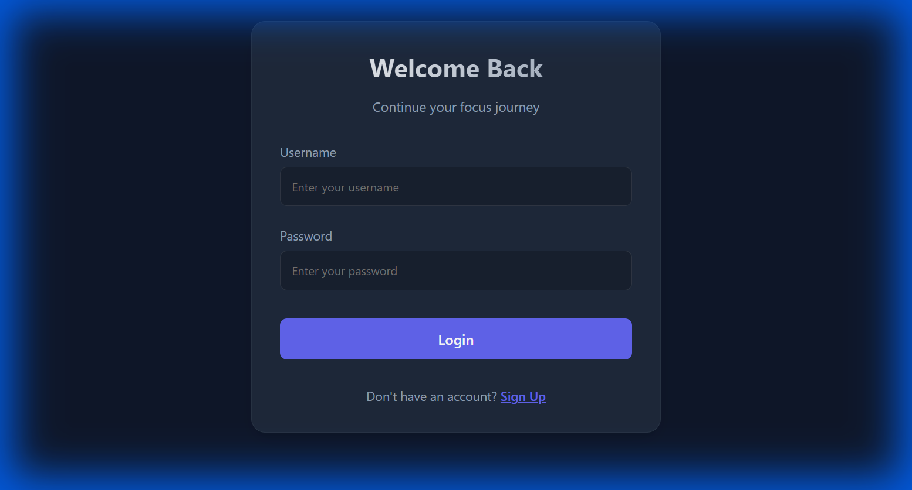
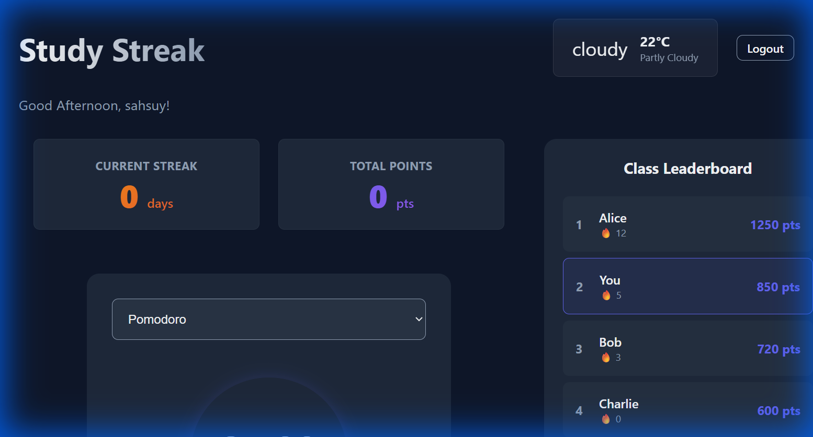
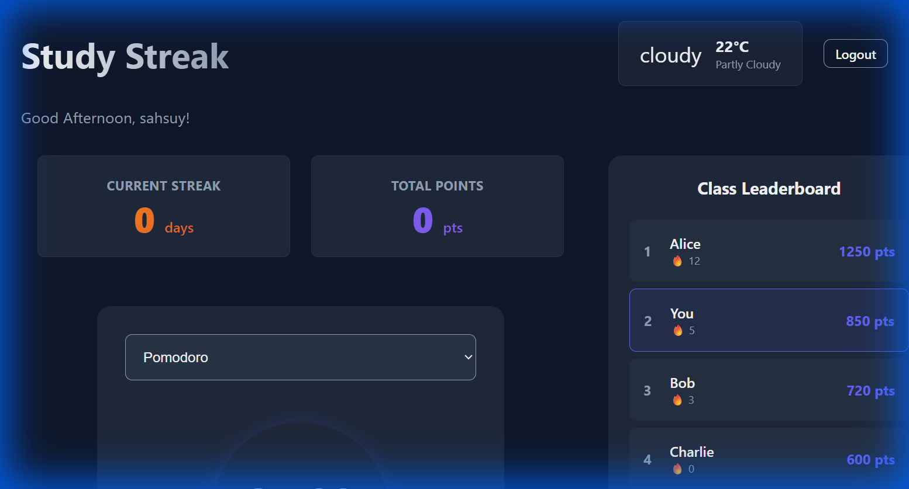
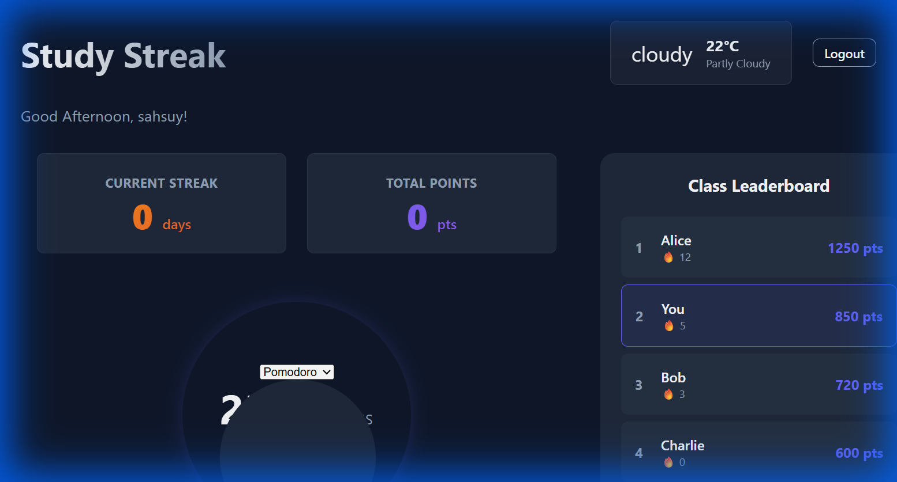

# **Study Streak**

> *A slightly addictive way to get things done.*

Study Streak turns your focus time into points, streaks, and just enough competition to keep things interesting.

---

##  **What It Is**

A clean, simple tool that helps you stay consistent using timed study sessions, light gamification, and a dashboard that doesn't yell at you.

---

##  **Features**

###  **Focus Modes**

Pick your pace:

* **Pomodoro (25/5)** — the usual
* **52/17 Rule** — for people who enjoy structure
* **90/20 Rule** — for people who enjoy suffering

###  **Soft Gamification**

* **Daily streaks**
* **50 points per session**
* **Leaderboard** (friendly competition, or pretend it's friendly)

### **Dashboard**

* Time-based greetings
* Weather widget (purely vibes)
* Occasional study tips

###  **Tasks**

* Add tasks
* Estimate time
* Mark priorities
* Feel mildly accomplished

---

## **Screenshots**

**Login:**



**Dashboard Overview:**



**Timer in Action:**



**Leaderboard:**



---

##  **Setup**

Requirements:

* Node.js
* A functioning keyboard
* Optional: Friends who like competing a little too much

Install:

```bash
git clone https://github.com/yourusername/study-streak.git
cd study-streak
npm install
npm run dev
```

Visit `http://localhost:5173`.

---

##  **How It Works**

1. Make an account
2. Pick a focus method
3. Start the timer
4. Study (or at least look like you are)
5. Earn points
6. Keep the streak alive

---

##  **Tech Stack**

* React 19
* Vite
* Vanilla CSS
* LocalStorage

---

##  **Design**

Minimal, dark mode–friendly, smooth animations, nothing too loud.

---

## **Contributing**

Find something to improve? Go for it.
PRs welcome.

---

##  **Credits**

* Coffee
* Timers
* Your future deadlines
* Yours truly, sahsuy

---
